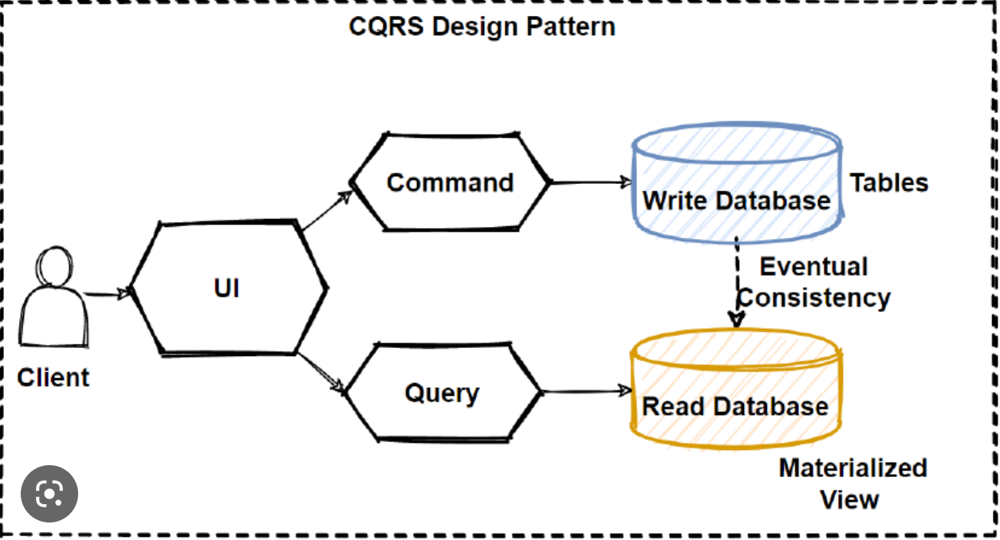
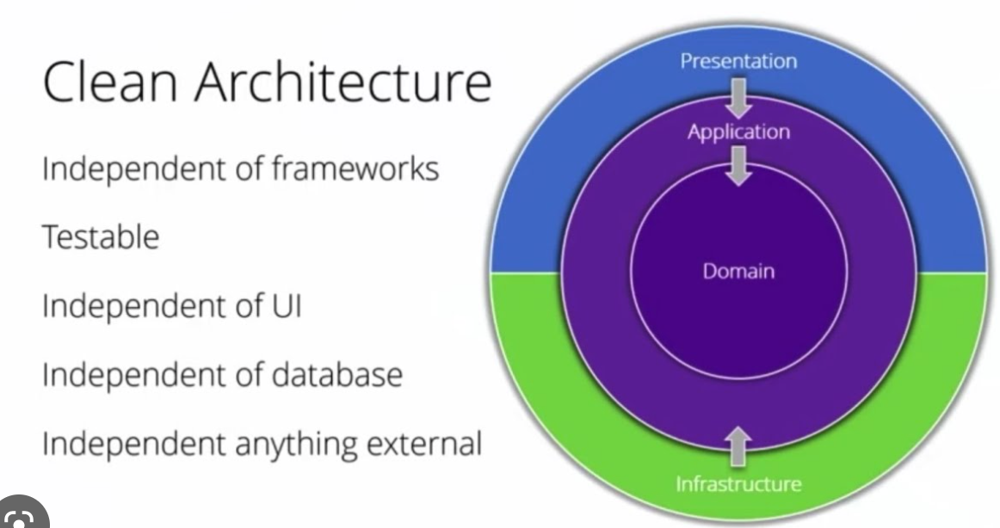
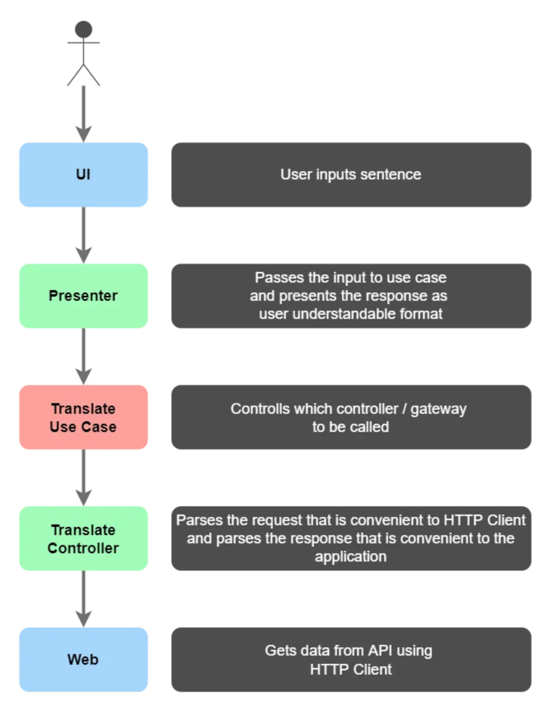

# CapFootTournament

## Dependecies

# CQRS

The Command and Query Responsibility Segregation (CQRS) model of segregation of command and query responsibilities separates read and update operations for a data store.

# clean architecture

Clean architecture is a software design philosophy that separates the elements of a design into ring levels. An important goal of clean architecture is to provide developers with a way to organize code in such a way that it encapsulates the business logic but keeps it separate from the delivery mechanism

