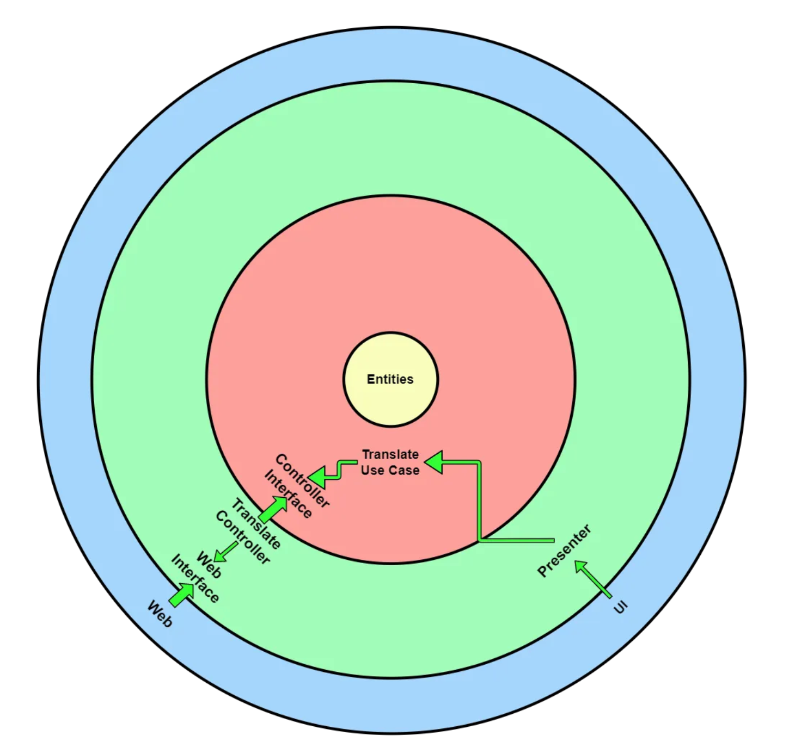

# CapFootTournament

## Dependecies

# CQRS

The Command and Query Responsibility Segregation (CQRS) model of segregation of command and query responsibilities separates read and update operations for a data store.

# clean architecture

Clean architecture is a software design philosophy that separates the elements of a design into ring levels. An important goal of clean architecture is to provide developers with a way to organize code in such a way that it encapsulates the business logic but keeps it separate from the delivery mechanism

## Creating the sql serer container command

docker run -e "ACCEPT_EULA=Y" -e "SA_PASSWORD=myPass123" -p 1433:1433 --name primeHotelDb -d mcr.microsoft.com/mssql/server:2017-latest

## Migration code

add-migration InitialMigration

Update-Database

## Reference

<a href="https://betterprogramming.pub/the-clean-architecture-beginners-guide-e4b7058c1165"> clean architecture medium</a>
